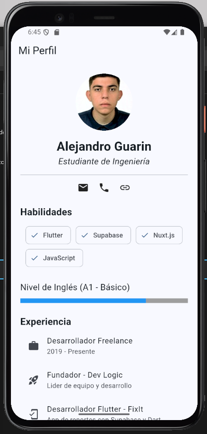

# Controles Salida Flutter 📱

Este proyecto es una práctica de diseño de interfaces en Flutter, enfocada en la creación de una pantalla de perfil profesional utilizando el catálogo de widgets nativos de Material Design.

## 🚀 Lo que incluye este proyecto:
* **Estructura de Layout**: Uso de `SingleChildScrollView` y `Column` para un diseño scrollable sin errores de desbordamiento.
* **Identidad Visual**: Implementación de `CircleAvatar` con imágenes cargadas desde el sistema de archivos (Assets).
* **Tipografía**: Estilización de textos para jerarquía de información (Nombre, Título, Secciones).
* **Componentes Adaptativos**: Uso de `Wrap` y `Chip` para mostrar habilidades técnicas de forma fluida.
* **Listas de Datos**: Implementación de `ListView` con `shrinkWrap` para integrar listas de experiencia dentro de columnas.
* **Indicadores de Estado**: Uso de `LinearProgressIndicator` para visualización de competencias lingüísticas.

## 🛠️ Estructura del Proyecto
El código está organizado de manera modular:
* `lib/main.dart`: Punto de entrada y configuración del tema.
* `lib/widget/profile_screen.dart`: Lógica y diseño de la pantalla principal.
* `assets/`: Carpeta dedicada a recursos multimedia.

## 📸 Previsualización

  

## 👤 Autor
**Alejandro Guarin** Founder & Project Leader en **Dev Logic**.  
Estudiante de Ingeniería Informática.